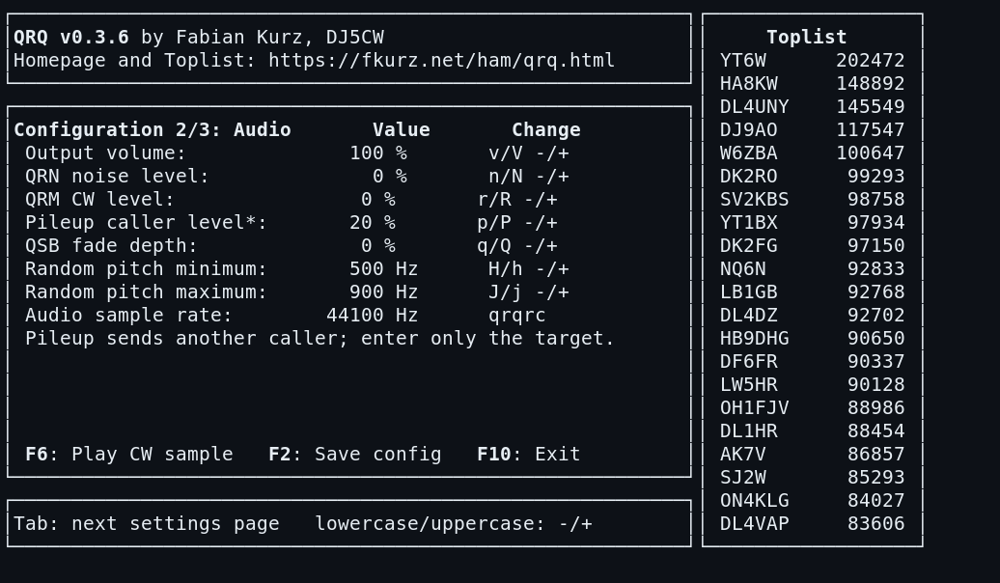
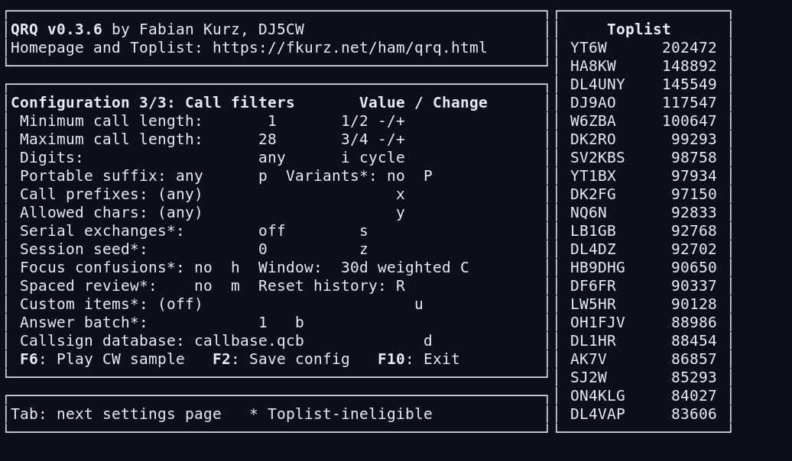

QRQ - yet another CW trainer - Version 0.3.6

[](https://github.com/garyPenhook/qrq/actions/workflows/ci.yml)
[](.github/workflows/ci.yml)
[](COPYING)

Project website: https://fkurz.net/ham/qrq.html
-----------------------------------------------------------------------------

qrq is an open source Morse telegraphy trainer, similar to the classic DOS
version of Rufz by DL4MM, for Linux, Unix, OS X and Windows. 

It's not intended for learning telegraphy (check out https://lcwo.net/ for
that!), but to improve the ability to copy callsigns (or words) at high
speeds, as needed for example in ham radio contesting.

## W4GNS fork enhancements

Credit: **W4GNS** designed and implemented every enhancement added in this
fork after the upstream QRQ 0.3.5 baseline. These additions include safer
data/configuration handling and builds; configurable session, speed, filter,
review, seeded-practice, and sustained-goal controls; persistent response-time, item-accuracy,
and character-confusion feedback; confusion-focused and spaced-review drills;
time-weighted, resettable confusion history; delayed-answer batch copy; QSB,
QRN, CW QRM, and caller-pileup simulation; zero-padded
contest serial-exchange, portable-call, and custom-item practice; refreshed
CWops practice data; W4GNS integration of the Super Check Partial contest
callbase; and the `qrq --version` console command. The feature descriptions
below document these W4GNS enhancements in detail.

## W4GNS quick practice guide

### Pileup simulation

Press F5, then Tab to **Configuration 2/3: Audio**. Use `P` to raise
`pileuplevel` in 5% steps (start around 15–25%); use `p` to reduce it. QRQ
sends a second, nearby-pitch caller after a short delay, but you copy and enter
only the target call. The usual one F6 resend replays the same target and
secondary caller. Pileup sessions are training-only and toplist-ineligible.



### Current confusion focus

Press F5, then Tab twice to **Configuration 3/3: Call filters**. Press `C`
to cycle all history, 7 days, 30 days, 90 days, and 365 days. The selected
window gives newer mistakes more influence in F7 statistics and in the
optional `focusconfusions=1` drill. Press `R`, then `y`, only when you want to
start clean: QRQ preserves the complete previous history as
`.confusions.csv.bak` and refuses to overwrite that backup.



Use one variable at a time: establish clean-copy accuracy first, add a modest
pileup level next, then use the confusion window to work on the mistakes that
are current. Raise difficulty only after accurate sessions.

-----------------------------------------------------------------------------

COMPILE / INSTALL

See separate file "INSTALL"

Run `qrq --version` to print the installed version in the console.

For a hardware-independent developer check, build the mock audio backend and
run the ncurses smoke suite from `src`:

```sh
make USE_MOCK_AUDIO=YES ui-smoke
```

This requires `expect` and exercises startup, serial and custom-item sessions,
sustained-goal continuation, summaries, and clean shutdown without producing
audio.

-----------------------------------------------------------------------------
How to use it

Using qrq is simple: qrq sends 50 random calls from a database. After each
call, it waits for the user to enter what he heard and compares the entered
callsign with the one sent. If the callsign is copied correctly, the overall
speed increases by the configured speed-up step and full points are credited.
If there were mistakes, it decreases by the configured speed-down step and
(depending on how many letters were correct) only a fraction of the maximum
points are credited.

When the overall speed falls below the configured character-speed floor, QRQ
uses Farnsworth timing: individual dots and dashes remain at the character
speed while the spacing between characters grows. The live score display shows
both the overall and effective character speeds.

A callsign can be heard again once by pressing F6, and F10 quits the attempt.
The INS key toggles between insert and overwrite mode in the callsign field.
F5 opens the settings selector: use Up/Down to select a setting and
Left/Right to change it. Tab or Page Down moves between the general, audio,
and call-filter pages; Shift-Tab or Page Up moves back. Enter edits a selected
text setting. During an attempt, F7 replays the previous callsign.
Outside an attempt, F7 shows local score, speed, and accuracy history.

Configured speeds range from 10 to 5000 CpM (2 to 1000 WpM). Adaptive
slowdown during a session stops at 20 CpM. The correct-answer and
wrong-answer steps are independently configurable.

For broad, non-repeating practice from a large callbase, leave
`sessionseed=0`. W4GNS QRQ seeds the selection stream from operating-system
entropy when available, then draws uniformly from unused entries; set a
nonzero `sessionseed` only when you want the same challenge sequence again.

There is a simple toplist function in qrq which makes it possible for the user
to keep track of his training success or to compare scores with others.

You can submit your highscores via email to fabian@fkurz.net and they will
appear on the toplist published at https://fkurz.net/ham/qrqtop.html.
The toplist is not protected by any kind of checksum, it's based on honesty.

Additionally to the toplist, a detail summary file for each attempt is saved
in the "Summary" sub directory (on Windows: in the qrq directory; on Linux:
in ~/.qrq/), containing all sent and received callsigns, speeds and points.

The toplist file also includes a timestamp of the attempt, which makes it
possible to keep track of your training progress. Pressing F7 shows the
in-program score history and the most frequent character-level copy
differences (for example, a sent `B` entered as `X`). QRQ stores these local
differences, each item's correctness, and answer time in separate versioned
CSV files. Repeated-call playback is excluded from recorded answer time. The
F7 screen also highlights the most frequently missed item. On supported
systems, QRQ falls back to a GNUplot graph when no local history can be
displayed. You may also import the files into your favorite spreadsheet
program to generate stats.

Set `focusconfusions=1` (or enable it with `h` on F5's call-filter page) to
create a training-only session from items containing symbols in your most
common recorded copy differences. When no relevant history exists, QRQ uses
the normal filtered callbase instead.

W4GNS `confusionrecencydays` keeps old mistakes from obscuring current copy
work. Set it to `0` for all history, or use `C` on F5's call-filter page to
cycle through 7-, 30-, 90-, and 365-day weighted windows. In a selected
window, the newest quarter of mistakes has four times the influence of the
oldest quarter; older entries are excluded. F7 shows the selected view and
confusion-focused drills use the same weighting. New records use timestamped
format v2. Older undated records remain in the all-history view only. Press
`R` on that F5 page and confirm with `y` to reset the complete local confusion
history safely: QRQ first renames it to `.confusions.csv.bak` and refuses to
overwrite an existing backup.

Set `spacedrepetition=1` (or use `m` on F5's call-filter page) for
training-only persistent review. A missed item is due in the next session;
after a correct copy, it is next due after 1, 3, 7, 15, and then 31 subsequent
attempts. Due items receive a selection boost while ordinary material remains
in the mix.

Set `answerbatch` to 2 through 5 (or use `b` on F5's call-filter page) to
send that many calls before QRQ accepts any entries. This is a retention and
short-term-copy drill for contest and pileup work; F6/F7 repeats are disabled
while it is active. Answer timing starts when each entry prompt appears, and
batch sessions are not toplist comparable.

Set `serialdigits` to 3, 4, or 5 (or use `s` on F5's call-filter page) to
replace the selected callsign database with every zero-padded serial exchange
of that width: for example, `000` through `999`. This is a training-only
contest-copy drill, so serial sessions are not toplist comparable. The `s`
key cycles off, 3, 4, and 5 digits.

Set `portablevariants=1` (or use `P` on F5's call-filter page) for W4GNS
portable-call practice. QRQ replaces the eligible base calls with `/P`, `/M`,
and `/MM` variants, providing a focused suffix-copy session. The portable
suffix filter is intentionally overridden while this generator is active;
forms longer than QRQ's 28-character item limit are skipped. Portable-variant
sessions are training-only and are not toplist comparable.

Set `customitems` to a comma-separated W4GNS drill list, or edit it with `u`
on F5's call-filter page. For example, `customitems=CQ,DE,5NN,?` builds a
focused contest-exchange drill; `customitems=QRZ,UP 5,/P` works for a short
operating-pattern drill. Items are normalized to uppercase, may contain CW
letters, digits, spaces, `/`, `-`, `.`, `=`, and `?`, and must be 28
characters or shorter. A nonempty custom list replaces the selected database
and other generators, and is training-only and toplist-ineligible.

W4GNS sustained-copy goals use `goalspeed` and `goalduration` together. Set a
speed target in CpM and a duration in seconds (both nonzero) to copy until the
duration expires while keeping the adaptive speed at or above the target. On
F5's general page, `o` sets or raises the speed in 25-CpM steps, while `O`
cycles the duration through 1, 3, 5, and 10 minutes. A speed drop fails the
goal; the end-of-session message gives a concise next-step recommendation.
Sustained goals are training-only and are not toplist comparable.

Set `qsblevel` from 0 to 100 (or use `q/Q` on F5's audio page) to apply slow
QSB-style fades to the signal. It is independent of QRN, so it can be used to
practice weak-signal copy with or without background noise.

Set `qrmlevel` from 0 to 100 (or use `r/R` on F5's audio page) to add
narrow-band CW interference. QRM arrives in short dot/dash-like bursts at
nearby audio frequencies and is independent of QRN and QSB.

Set W4GNS `pileuplevel` from 0 to 100 (or use `p/P` on F5's audio page) for a
true two-caller pileup. QRQ selects a separate item from the active callbase,
starts it at a nearby pitch after a short delay, and mixes it under the target;
the target remains the only accepted answer. F6 keeps the same secondary
callsign with the replay. Pileup sessions are explicitly training-only and
toplist-ineligible.

Options can be changed in the config file qrqrc or via the three-page F5 menu.
This includes volume, QRN, QRM, pileup, QSB-style fading, fixed or random
pitch, call length and content filters, missed-call review, adaptive selection,
confusion recency, accuracy goals, and reproducible session seeds. The audio
sample rate is intentionally read-only in F5 because audio is initialized
before the menu opens; set it in qrqrc.

Only an ordinary, completed 50-call session is comparable in the toplist.
Fixed-speed, unlimited-repeat, non-50-call, adaptive, review, batch-copy,
serial-copy, custom-item, sustained-goal, and seeded sessions are still
recorded in local history but are toplist-ineligible. Portable-variant sessions
and pileup sessions are also toplist-ineligible.
Aborted or incomplete sessions are also excluded. If an accuracy goal is set,
the completed session must meet it.

The standard distribution contains four databases: callbase.qcb (many
callsigns, taken from real logs), english.qcb (English words), cwops.qcb
(CWops members with name and number, training for the CWT mini contest), and
W4GNS-integrated `morserunner.qcb` (50,029 worldwide contest callsigns). The
last is a content-preserving Super Check Partial snapshot, released 2026.08.07
and retrieved 2026-08-10; select it with F5's database chooser. Its preserved
header and [source attribution](src/MORSE_RUNNER_CALLS.md) travel with QRQ.
Additional user contributed QCB files can be found at:
https://git.fkurz.net/dj1yfk/qrq/src/branch/master/extras

A small Perl script, qrqscore, to synchronize the online-toplist
(https://fkurz.net/ham/qrqtop.php) with your local toplist is included as of
version 0.1.2.

-----------------------------------------------------------------------------

Download, License

Of course qrq is free software (free as in beer and free as in freedom) and
published under the GPL 2.

If you wish to use the files coreaudio.h and coreaudio.c in a project separate
from qrq, they are licensed under the MIT license.

-----------------------------------------------------------------------------

Contact, Feedback

I am always interested in any kind of feedback concerning qrq.
If you have any suggestions, questions, feature-requests etc., don't hesitate
a minute and contact the author: Fabian Kurz, DJ5CW <fabian@fkurz.net>.
